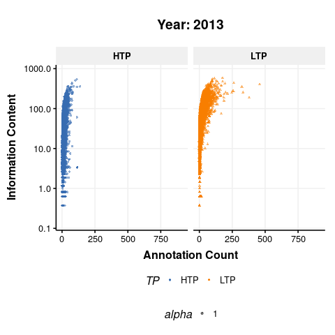

I am currently working on two projects:

## IgnoroMeNot: Prioritizing under-annotated proteins for literature curation
Here's a table listing potential publications on under-annotated human proteins. These proteins currently do not have any Gene Ontology annotations in UniProt (as of Feb 2025)

```{r echo=FALSE}
library(knitr)
library(DT)
data <- read.delim("potential_pubs.tsv",header=TRUE,sep="\t")
DT::datatable(data)
```


## Concise List Enrichment Analysis using R (CLEAR)

